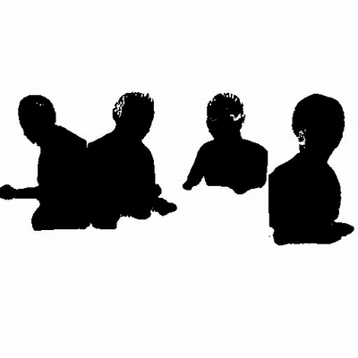
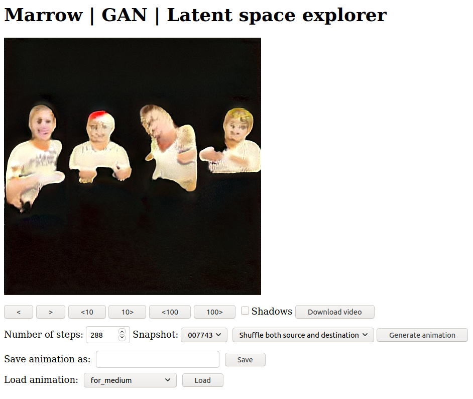
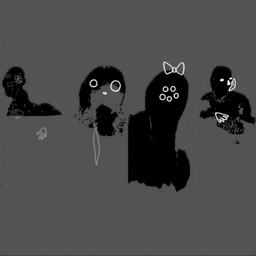

# Developers and Artists: Exploring GAN's latent space hand in hand

> In January 2020 we finalized the development phase of _Marrow_. In this series of posts, Shirin Anlen and myself are sharing what we have learned during this process. The [first post](https://medium.com/@s.h.i.r.i.n/7f7db708f06d) was about constructing a well-formed dataset, despite having little resources. This post is about working with artists when exploring the latent space of GAN


## Myself and Marrow

Marrow is a hands-on research initiative and interactive installation by [Shirin Anlen](https://shirin.works), exploring the possibilities of [mental disorders in machine learning](https://immerse.news/when-machines-look-for-order-in-chaos-198fb222b60a). I have previously worked with Shirin on numerous projects, most notably the VR documentary [_Tzina: Symphony of Longing_](https://tzina.space). In 2018 I joined forces with Shirin once more to preview _Marrow_ as an installation at [IDFA Doclab 2018](https://www.doclab.org/2018/ive-always-been-jealous-of-other-peoples-families/). The prototype was a success, and one year later we went as co-creators to an intensive development phase produced by the [National Film Board of Canada](https://www.nfb.ca/interactive/marrow/) and [Atlas V](https://atlasv.io/).

## About GAN's latent space

The [previous post](https://medium.com/@s.h.i.r.i.n/7f7db708f06d) described how we created a dataset of _Perfect family dinners_ and used it to train [StyleGAN V1](https://github.com/NVlabs/stylegan). The result wasn't perfect, but that was what we aimed for: A distorted image of what it means to be a happy family, if your entire life experience comes from internet stock images. 

Our dataset was a bundle of around 6,500 images containing aligned figures of four family members, stripped away from their family dinner setting. Once StyleGAN finished training (in fact we stopped it once the quality started to deteriorate), we ended up with a vast space of possible new images containing four distorted familial figures. The infinite, continuous, space of possibilities for an output image is called the [_Latent Space_](https://en.wikipedia.org/wiki/Latent_variable). It is called so because the final output image generated by GAN is determined by a seemingly _hidden_ process of transformations, staring from a series of numbers (in our case 512 numbers), and ending with a bitmap image (in our case a 512x512 image). When you change any of those numbers, the resulting image would be slightly different. The transformation network is so deep, that it's hard to predict what would be the change.

If you have a good enough dataset and algorithm, you might be able to achieve _disentanglement_: that is when one of those numbers (out of 512) controls one meaningful element in the result image, for example one number changes the age of the generated person while another changes their hair color. Needless to say we were not able to achieve that with our [small dataset](https://medium.com/@s.h.i.r.i.n/). Changing one number could induce any number of changes in one or more of the four family figures: one family might change their pose, while another starts to smile, and third one suddenly puts on a christmas hat (a repeating motif in stock images, it seems).


## The Shadow Allegory

As much as visualizing the latent space is intriguing, we were looking for a sharper, more conceptual, and artistic way to talk about the in-between spaces of GAN's distorted image of the world. Plato's [Allegory of the cave](https://en.wikipedia.org/wiki/Allegory_of_the_cave) speaks about finding comfort in simple and flattened representation of things, not being able to face the depth of reality. The people in the allegory are stuck in a cave, with a fire burning outside. The fire projects the shadows of passing by objects on the cave's walls, and that is that all the they can see of reality. They are so used to those shadows, that once one prisoner breaks free, his eyes get burned by the flaring sun. When the prisoner's eyes are finally accustomed to reality, he comes back to the cave to tell the others, but now he is unable to see anything in the darkness. The other prisoners assume that something evil lies outside. 

Interestingly, Plato's allegory of the cave corresponds quite well with the [structure and training process of GAN](https://developers.google.com/machine-learning/gan/gan_structure). GAN is in constant conflict between reality, representations of reality, and fantasy. When the algorithm gets too close to generating images that match the dataset, it finds itself stuck in a simple and flat representation of the world, unable to escape to creativity. When GAN's generations are too fantastical, they are deemed as fake and wrong. GAN is in a constant struggle to find the balance between the real and the imaginary. Therefore, we decided to visualize GAN's struggle by using the _shadow representation_ of the distorted family outputs.

Full color                |  Shadow
:----------------------------:|:------------------------------------:
    |  

## Animating over the latent space

Since the _Marrow_ experience happens within a social narrative, We wanted to bring an additional storytelling element into the mix. In the experience, a human character representing GAN is telling her family about her relationship with those shadow figures as a representation of her family. She is being pulled by the shadows into this comforting, yet somewhat eerie imaginary world, only to be pulled back into the threatening depths of reality by her family. Hence, we decided to work with an artist, and animate a fantastical layer over the world of the shadows. We worked with the talented [Paloma Dawkins](https://palomadawkins.com/), a master of hand-drawn animations and alternate dimensions. But now we had to ask ourselves: "how do we orchestrate a workflow that starts in the mathematical depths of GAN, but ends with hand drawn animations that perfectly match GAN's latent movements across in latent space?". The answer came in the form of our custom developed _Marrow GAN Explorer_.

## The Marrow GAN Explorer

>The Marrow GAN Explorer is an interactive web-based tool that lets users explore the latent space of [StyleGAN V1](https://github.com/NVlabs/stylegan) and create chains of key-framed animations between different points on the space.



### The motivation

The main motivation for the development of this tool was to allow an animator to explore the latent space and choose transitions that they find more interesting to animate. Once chosen, they can save that transition in format that is readable byt he machine learning model and can be loaded and played in real time. At the same time, the animator can save the transition as a video file that they can load in their animation software and animate frame by frame.

### Use-case scenario

The workflow normally works as follows:

1. The animator chooses a _snapshot_ of the model - that is a point in time of the training process. Sometimes, our case included, a snapshot of the model at the middle of the training produces better results than the snapshot at the end of the training.

2. The animator chooses the number of _steps_ , i.e the number of frames in the animation. The beauty of exploring the latent space is that because it is made of a continuous vector of numbers, one can choose any number of steps and this determines the smoothness of the transition. In our case, the animator was drawing at 12 frames per second, so choosing 288 steps would mean a 24 second long animation.

3. The animator starts by choosing _Shuffle both source and destination_, which would produce an entirely new transition sequence, and clicking on _Generate animation_.

4. The model now generates a transition sequence of 288 frames between two 'families'. The animator can cycle through the frames faster or slower using the arrow buttons. An extra _Shadows_ checkbox allows the animator to view the frames either in full color or in 'shadow mode'.

5. If the animator likes this sequence, they give it a name and save it. The details of the sequence are now saved on the server. If they wish to cycle to another transition, they can go back to stage (1).

### Chaining animations

On of the more neat features of the explorer is the ability to chain animations. Suppose the animator drew a nice 24 second animation for one transition sequence, but now they want to move forward with the story and choose a following sequence. By loading the first transition and then choosing _Use destination as the next source_, the artist can generate a sequence that is a continuation of the previous one. If they liked it, they can save it, but if they didn't, they can now use the _Keep source and shuffle destination_ button to continue cycling between sequences that are all a continuation of the first one.

### Playback in real-time

Once all of the animations are ready, our GAN streaming engine is ready to load the saved animations and play them back at the desired speed in real time. Through our main orchestrating engine, we trigger the playback of the overlaying animation and the real time GAN calculation of the sequence at the same time, resulting in a perfectly matched GAN overlay animation.



## The code

The code for the latent space explorer is freely available [here](https://github.com/Raycasters/Marrow/tree/master/gan/gan-explore). It will need adjustments for other projects, but they should be quite simple if the model is based on StyleGAN. 


## Under the hood

This section is dedicated to machine learning enthusiasts, listing some of the more interesting features under the hood of the Marrow GAN Explorer. 

### Generating transitions with StyleGAN and Numpy
Images are generated from a one-dimensional Z vectors of 512 numbers. Initializing random Z vectors is easy with Numpy:
```        
self.rnd = np.random.RandomState()
self.latent_source = self.rnd.randn(512)[None, :]
self.latent_dest = self.rnd.randn(512)[None, :]
``` 
Once we have a source and destination for the transition, interpolations are done using Numpy's _linespace_ function:

```
self.steps = int(args['steps'])
self.linespaces = np.linspace(0, 1, self.steps)
self.linespace_i = 0
```
To generate the image using StyleGAN, we simply apply the linespace with our source and dest vectors in the following manner:
```
self.latents = (self.linespaces[self.linespace_i] * self.latent_dest + (1-self.linespaces[self.linespace_i]) * self.latent_source)

images = self.Gs.run(self.latents, None, truncation_psi=0.7, randomize_noise=False, output_transform=self.fmt)
image = images[0]
```
Note the _randomize_noise=False_ argument. If we were to set it to true, we would still have some random noise added to every image. While this may work well to simulate a more organic output, it doesn't suit our purpose of matching with a pre-baked animation.

Saving and loading Z-vectors is also very easy with Numpy:
```
with open('animations/{}/source.npy'.format(args['name']), 'wb+') as source_file:
    np.save(source_file, self.latent_source)
... 
# Loading
self.latent_source = np.load('animations/{}/source.npy'.format(args['animation']))
```

### Communicating between a Flask web server and a TensorFlow session thread

A TensorFlow session has to run in its own thread, independently of the web server. However, insofar as the web functions have to wait for GAN's output before returning to the browser, I needed a mechanism for synchronization. I opted to use threadsafe [queue](https://docs.python.org/3/library/queue.html) to send requests from Flask's web function to the GAN host, and [asyncio futures](https://docs.python.org/3/library/asyncio-future.html) as a low-level signaling mechanism between GAN and the web functions.

The GAN thread loops indefinitely while waiting for queue requests, and it is aware of the main asyncio loop that is running. When Flask gets a _generate_ request, it puts a new message in GAN's queue, along with a new _future_ object that is used as the _done_ callback:
```
@app.route('/generate')
def generate():
    future = loop.create_future()
    q.put((future, "generate", request.args))
    data = loop.run_until_complete(future)
    return jsonify(result=data)
```
The GAN thread picks up the message, generates the image and sets the _future_ as _done_ when it is ready:
```
(future,request,args) = self.queue.get()
if request == "generate":
    ...  # Generate the image into a b64text
    self.loop.call_soon_threadsafe(
        future.set_result, b64text
    )
```
One special handling is needed when a new snapshot is selected. I found that I had to close the TensorFlow session, join the thread, and restart it with the new snapshot:
```
# At the GAN thread
if args['snapshot'] != self.current_snapshot:
    self.current_snapshot = args['snapshot']
    tf.get_default_session().close()
    tf.reset_default_graph()
    break

# At the web server
global gan
gan.join()
args.snapshot = params['snapshot']
gan = Gan(q, loop, args)
gan.start()
```

## Conclusion

Custom web-based tools allow artists and developers (let us assume there are really such definitions for the purpose of this text) to work seamlessly in a machine learning context. In a manner not unlike the process of level design in games, these tools are focused on creation at the frontend, but speak the language of modularity and recreation at the backend. We had a lot of fun sitting together, viewing and choosing sequences during the creation of _Marrow_. But while we were witnessing the intense visuals in front of us, the data that was saved on the server was a simple series of numbers that trigger a vast computational network with unforeseen, yet consistent consequences. Likewise, we didn't always know why we liked a particular sequence, but the decision was often anonymous. Perhaps it was our common intuition.


